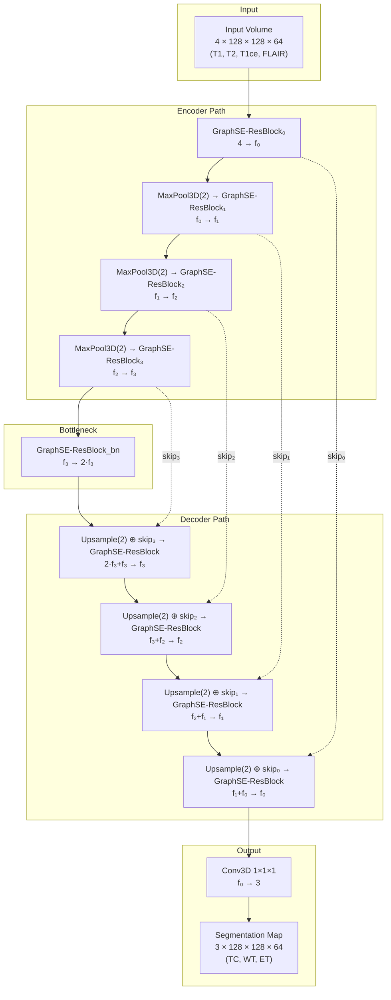
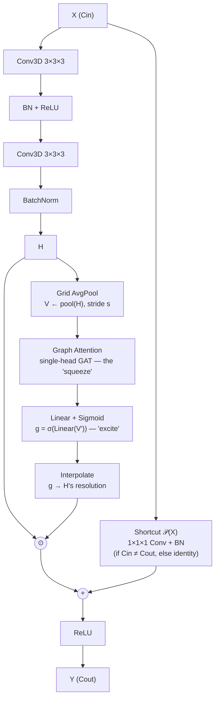

And the block-level detail for `GraphSE-ResBlock` itself, matching the fused design we settled on:

The two diagrams are consistent with each other — every `GraphSE-ResBlock` box in the top-level architecture expands to the second diagram. Only structural change from your earlier version: one block per level instead of two (`ResConvBlock` + `GraphSEBlock`), so the encoder/decoder path is now nine fused blocks instead of nine block-pairs.