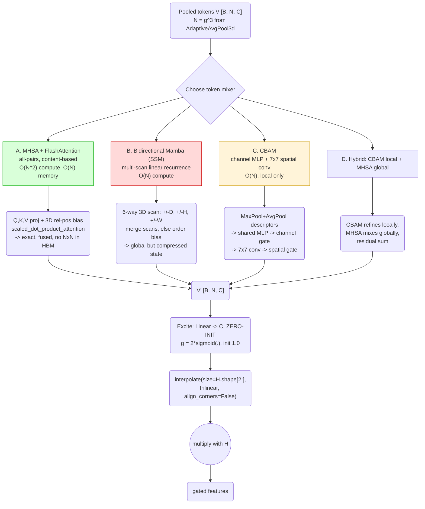

Let me quantify the trade-offs before recommending.

# Swapping the Token-Mixer: MHSA vs. Mamba vs. FlashAttention vs. CBAM

## 0. First, an important correction

**FlashAttention is not a different attention protocol.** It is an IO-aware, tiled *implementation* of exact softmax self-attention — same math, same outputs, same gradients, just never materializing the `[N,N]` matrix in HBM. So "MHSA vs. FlashAttention" is not a design choice; **FlashAttention is how you should always run MHSA**. In PyTorch you get it for free via `F.scaled_dot_product_attention`. I'll treat it as an implementation flag on the MHSA variant, not a fifth option.

Also worth naming precisely: **Mamba is not attention.** It's a selective state-space model — a *linear recurrence* with input-dependent gating. It has no pairwise interaction term at all; tokens communicate only through a compressed state passed along a scan order. That distinction drives everything below.

Your block has a clean interface: `[B, N, C] tokens → mix → [B, N, C]`. Every option below is a drop-in for that slot.

---

## 1. Measured Cost Comparison

At `C=256`, 4 heads, per sample, counting only the mixer:

| Grid | Tokens N | Mixer | GFLOPs | Attn/state memory | Params (K) |
|---|---|---|---|---|---|
| **6³** | 216 | MHSA (Flash) | 0.161 | **0.36 MiB** | 262 |
| | | GATv2 (yours) | 0.157 | 22.78 MiB | 262 |
| | | Mamba (6-scan) | 1.120 | 20.25 MiB | 1671 |
| | | CBAM | **0.0002** | 0 | **8.3** |
| **8³** | 512 | MHSA (Flash) | 0.537 | **2.00 MiB** | 262 |
| | | GATv2 | 0.604 | 128.00 MiB | 262 |
| | | Mamba (6-scan) | 2.655 | 48.00 MiB | 1671 |
| | | CBAM | 0.0002 | 0 | 8.3 |
| **10³** | 1000 | MHSA (Flash) | 1.548 | **7.63 MiB** | 262 |
| | | GATv2 | 1.929 | 488.28 MiB | 262 |
| | | Mamba (6-scan) | 5.186 | 93.75 MiB | 1671 |

**Three findings that should decide this for you:**

1. **MHSA strictly dominates your GATv2** at every grid size — same parameter count, comparable or fewer FLOPs, and **64× less activation memory** (2 MiB vs 128 MiB at 8³), because GATv2's additive scoring must materialize `[N,N,C]` while dot-product scoring only needs `[N,N]`. There is no regime in your block where GATv2 wins on cost.

2. **Mamba's O(N) advantage never activates here.** I solved for the crossover: at `C=256`, a 6-scan Mamba only becomes cheaper than dense MHSA at **N > 4,552 tokens ≈ a 17³ grid**. Your block operates at 216–512 tokens. Below the crossover, Mamba costs **2–7× more FLOPs** than the attention it's supposed to replace, plus 6.4× the parameters. Mamba is the right tool at stride-2/stride-4 full-resolution volumes (where MHSA needs 512 GiB and is simply impossible) — but that is *not* your block's operating point.

3. **CBAM is essentially free** — 0.0002 GFLOPs, 8.3K params, ~800× fewer params than the attention variants. It is the correct *baseline*, and if it matches your block, the whole design is unjustified.

---

## 2. What each option actually buys you



### A. Multi-Head Self-Attention + FlashAttention ✅ **Recommended**
- **Gain:** true all-pairs content-based routing. With a 3D relative-position bias it is a superset of what your GATv2 computes — a dense graph *is* self-attention, and dot-product scoring is the same function class as additive scoring for practical purposes (Vaswani et al. found no quality gap, only a speed gap).
- **Cost:** O(N²) FLOPs but O(N) memory under Flash. At N≤512 this is trivial.
- **Risk:** needs warmup + pre-norm, and needs positional encoding (same flaw as your current block).
- **Verdict:** this is your GATv2 block, but faster, leaner in memory, and backed by fused kernels.

### B. Bidirectional / multi-scan Mamba ⚠️ **Wrong operating point**
- **Gain:** linear scaling — the *only* option that works if you want to mix tokens at stride-2 or stride-4 resolution (where MHSA needs 512 GiB).
- **Problems at your scale:** (i) 2–7× *more* FLOPs than MHSA below 4,552 tokens; (ii) inherently **causal and order-dependent** — a 3D grid has no canonical scan order, so you need 6-way (±D, ±H, ±W) or 8-way scanning à la VMamba/Vision Mamba, which is what makes it expensive; (iii) 6.4× params; (iv) fixed-size state means it *compresses* rather than truly attends, so fine-grained pairwise structure is lost; (v) requires `mamba-ssm` custom CUDA kernels — a real deployment/portability tax.
- **Verdict:** keep it in your pocket for a *different* block — a full-resolution mixer in encoder stage 1–2. Do not use it at 6³.

### C. CBAM ✅ **Best cost/benefit; mandatory baseline**
- **Gain:** near-zero cost, no positional-encoding requirement (its 7×7 conv is inherently spatial), trivially stable, no warmup needed.
- **Limit:** the spatial branch is a **single convolution** — receptive field 7 (or 3×3×3 in 3D), so it cannot do long-range routing at all. On a 6³ grid, though, a 3×3×3 conv already covers half the grid, which sharply narrows the gap to global attention.
- **Verdict:** if this matches your GAT block on validation Dice — and on a 6³ grid it very plausibly will — ship CBAM and delete the graph.

### D. Hybrid (CBAM → MHSA, residual) — best accuracy if budget allows.

---

## 3. Unified Drop-In Implementation

All four mixers share one interface, so you can ablate by changing a string.

```python
import torch, torch.nn as nn, torch.nn.functional as F

# ---------- A. MHSA + FlashAttention + 3D relative position bias ----------
class MHSAMixer(nn.Module):
    def __init__(self, c, grid, heads=4, p=0.1):
        super().__init__()
        self.h, self.dh, self.g = heads, c // heads, grid
        self.norm = nn.LayerNorm(c)
        self.qkv  = nn.Linear(c, 3 * c, bias=False)
        self.proj = nn.Linear(c, c)
        self.p    = p
        # relative position bias over a g^3 grid: offsets in [-(g-1), g-1] per axis
        self.rpb = nn.Parameter(torch.zeros(heads, (2*grid-1)**3))
        idx = torch.arange(grid)
        coord = torch.stack(torch.meshgrid(idx, idx, idx, indexing='ij')).flatten(1)  # [3,N]
        rel = (coord[:, :, None] - coord[:, None, :]) + (grid - 1)                    # [3,N,N]
        flat = (rel[0]*(2*grid-1) + rel[1])*(2*grid-1) + rel[2]
        self.register_buffer('rel_idx', flat, persistent=False)

    def forward(self, v):                       # v: [B,N,C]
        B, N, C = v.shape
        q, k, val = self.qkv(self.norm(v)).chunk(3, -1)
        shp = lambda t: t.view(B, N, self.h, self.dh).transpose(1, 2)
        bias = self.rpb[:, self.rel_idx].unsqueeze(0)                     # [1,h,N,N]
        out = F.scaled_dot_product_attention(                             # -> FlashAttention
            shp(q), shp(k), shp(val), attn_mask=bias,
            dropout_p=self.p if self.training else 0.0)
        return self.proj(out.transpose(1, 2).reshape(B, N, C))
```

> Note: passing an additive `attn_mask` makes PyTorch fall back to the memory-efficient (not the pure-Flash) kernel. If you need maximum speed, drop the bias and rely on the learned absolute positional embedding instead — you keep the fused Flash path.

```python
# ---------- C. CBAM, adapted to 3D tokens ----------
class CBAMMixer(nn.Module):
    def __init__(self, c, grid, r=16, k=3):
        super().__init__()
        self.g = grid
        self.mlp = nn.Sequential(nn.Linear(c, c // r), nn.ReLU(inplace=True), nn.Linear(c // r, c))
        self.spatial = nn.Conv3d(2, 1, k, padding=k // 2, bias=False)

    def forward(self, v):                       # [B,N,C]
        B, N, C = v.shape
        ca = torch.sigmoid(self.mlp(v.mean(1)) + self.mlp(v.amax(1)))     # channel gate [B,C]
        v = v * ca.unsqueeze(1)
        x = v.transpose(1, 2).reshape(B, C, self.g, self.g, self.g)
        sa = torch.sigmoid(self.spatial(torch.cat([x.mean(1, True), x.amax(1, True)], 1)))
        return (x * sa).flatten(2).transpose(1, 2)

# ---------- B. Bidirectional multi-scan Mamba (optional dependency) ----------
class MambaMixer(nn.Module):
    """6-way 3D scan. Only worth it above ~4.5k tokens; included for completeness."""
    def __init__(self, c, grid, d_state=16, expand=2):
        super().__init__()
        from mamba_ssm import Mamba                       # pip install mamba-ssm
        self.g, self.norm = grid, nn.LayerNorm(c)
        self.scans = nn.ModuleList([Mamba(d_model=c, d_state=d_state, expand=expand) for _ in range(6)])
        self.merge = nn.Linear(c * 6, c)

    def _orders(self, B, C):
        g = self.g
        perms = [(0,1,2), (0,2,1), (1,0,2)]              # D-, H-, W-major
        for p in perms:
            for rev in (False, True):
                yield p, rev

    def forward(self, v):
        B, N, C = v.shape
        g, z, outs = self.g, self.norm(v), []
        x = z.transpose(1, 2).reshape(B, C, g, g, g)
        for (p, rev), blk in zip(self._orders(B, C), self.scans):
            t = x.permute(0, 1, *[2 + i for i in p]).flatten(2).transpose(1, 2)
            if rev: t = t.flip(1)
            o = blk(t)
            if rev: o = o.flip(1)
            # invert the permutation back to canonical DHW token order
            inv = torch.empty(3, dtype=torch.long); inv[list(p)] = torch.arange(3)
            o = o.transpose(1, 2).reshape(B, C, g, g, g).permute(0, 1, *[2 + i for i in inv.tolist()])
            outs.append(o.flatten(2).transpose(1, 2))
        return self.merge(torch.cat(outs, -1))

# ---------- Unified excitation block ----------
MIXERS = {'mhsa': MHSAMixer, 'cbam': CBAMMixer, 'mamba': MambaMixer}

class Excite3D(nn.Module):
    def __init__(self, c, grid=6, mixer='mhsa', **kw):
        super().__init__()
        self.g = grid
        self.pos = nn.Parameter(torch.zeros(1, grid**3, c)); nn.init.trunc_normal_(self.pos, std=.02)
        self.mix = MIXERS[mixer](c, grid, **kw)
        self.gamma = nn.Parameter(torch.full((c,), 1e-4))          # LayerScale
        self.excite = nn.Linear(c, c)
        nn.init.zeros_(self.excite.weight); nn.init.zeros_(self.excite.bias)   # identity at init
        self.use_pos = mixer != 'cbam'                              # CBAM is already spatial

    def forward(self, x):
        B, C, *sp = x.shape
        v = F.adaptive_avg_pool3d(x, (self.g,)*3).flatten(2).transpose(1, 2)
        v = v + self.pos if self.use_pos else v
        v = v + self.gamma * self.mix(v)
        g = 2.0 * torch.sigmoid(self.excite(v))
        g = g.transpose(1, 2).reshape(B, C, self.g, self.g, self.g)
        return x * F.interpolate(g, size=sp, mode='trilinear', align_corners=False)
```

Swap with one argument: `Excite3D(256, grid=6, mixer='cbam')`.

---

## 4. Tuning Differences Per Mixer

These are **not** interchangeable at the hyperparameter level — reusing one recipe across all four is the most common way ablations get invalidated:

| | MHSA/Flash | Mamba | CBAM |
|---|---|---|---|
| LR (AdamW) | 3e-4 | **1e-4** (SSM params are LR-sensitive) | 1e-3 (tiny, robust) |
| Warmup | **required**, 500–1000 steps | required, 1000+ | not needed |
| Weight decay | 0 on `pos`, `rpb`, `gamma`, norms | **0 on `A_log`, `D`, `dt_bias`** — decaying these breaks the SSM | standard |
| Precision | bf16, softmax in fp32 | bf16; selective-scan kernel is fp32-internal | fp16/bf16, anything works |
| Grad clip | 1.0 | 1.0 | rarely needed |
| Dropout | attn 0.1 + stoch. depth 0.1 | 0.05 | 0 |
| Positional info | **must add** (abs embed or rel bias) | implicit in scan order — but biased, hence multi-scan | inherent (conv) |

---

## 5. My Recommendation

**Run this ladder, holding everything else fixed:**

1. Plain pre-act res block (no gate) — floor
2. **`mixer='cbam'`, grid=6** — the cheap baseline that must be beaten
3. **`mixer='mhsa'`, grid=6, 4 heads** — the strong, well-proven candidate
4. `mixer='mhsa'`, grid=8 — does more spatial resolution help?
5. Your original GATv2 — does additive scoring beat dot-product?
6. `mixer='mamba'` — only if you also test it at stride-4 full resolution, where it's actually the right tool

**Default choice: replace GATv2 with MHSA + FlashAttention.** It is same-params, same-FLOPs, 64× lighter in activation memory, and hardware-accelerated — a strict improvement on your current mixer at every grid size I measured. Keep `grid=6` for encoder stages 3–4 and `grid=8` at the bottleneck.

**But run CBAM first, because it takes an hour.** At 216 tokens, "global" attention spans a grid a 3×3×3 conv already half-covers, so the theoretical advantage of all-pairs routing is much smaller than it looks. If CBAM ties MHSA on validation Dice, take the 800× parameter saving and move on — that's a real result, not a failure.

**Do not use Mamba here.** Its linear scaling is a genuine advantage, but it doesn't activate until ~4,552 tokens, and your block runs at 216–512. Below that crossover you pay 2–7× more FLOPs and 6.4× more parameters for a *weaker* mixing primitive (compressed state, order-dependent) plus a custom-CUDA dependency. If you want Mamba in this network, put it somewhere it earns its keep: a stride-2 or stride-4 full-resolution mixer in encoder stages 1–2, where MHSA would need 512 GiB and is flatly impossible.
